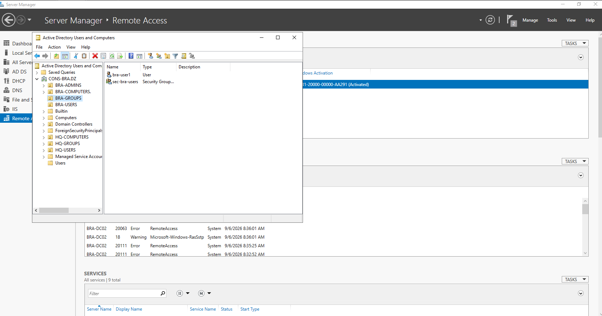
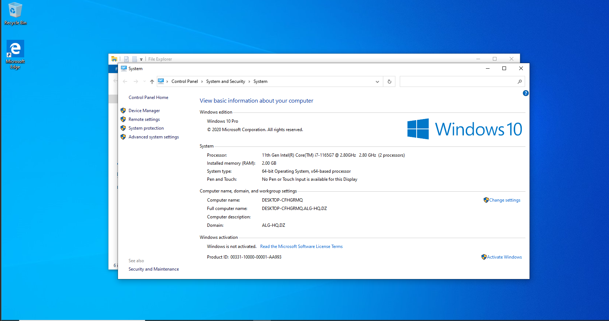
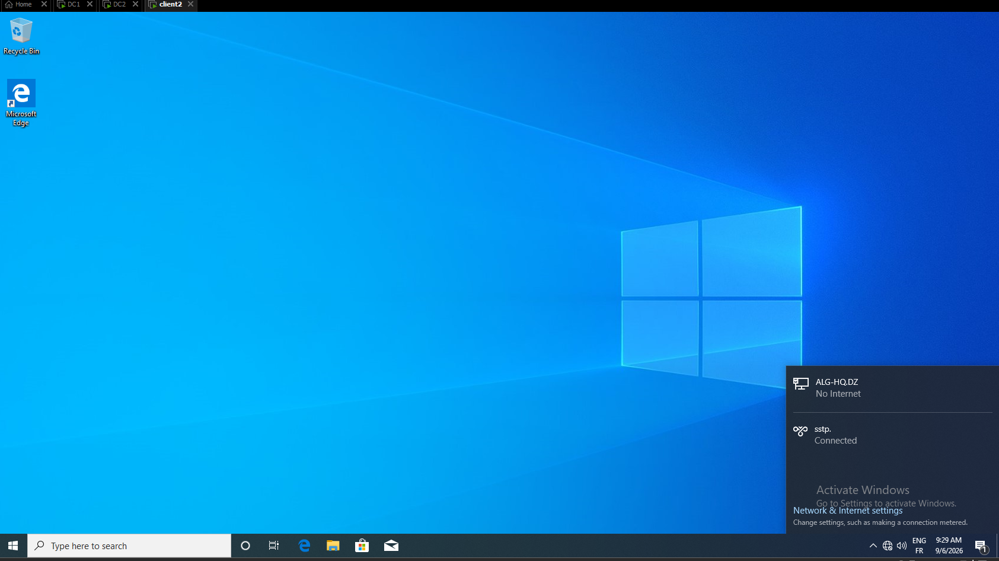
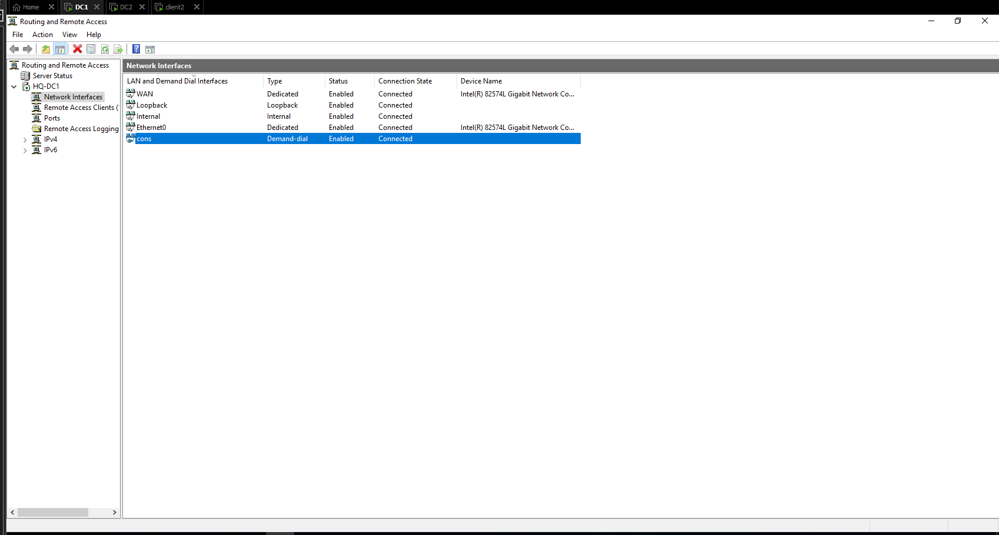
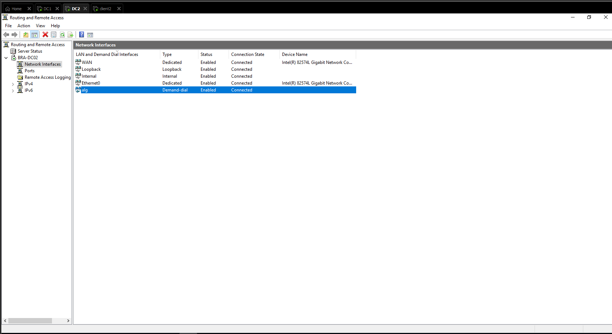
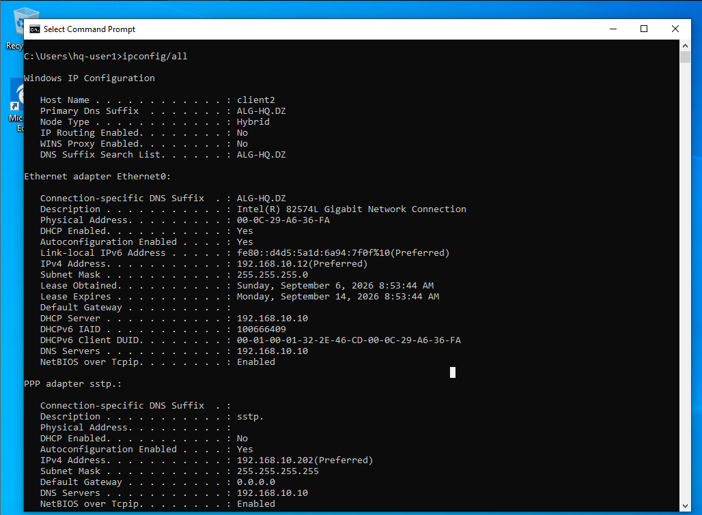
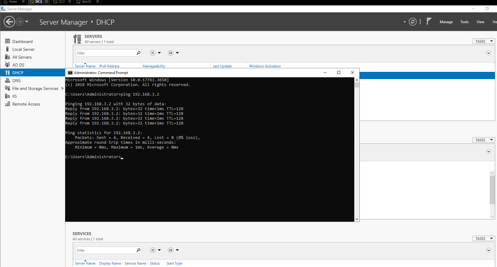
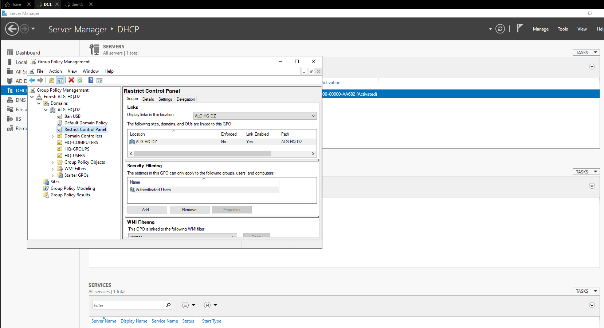

## Project Overview
This repository documents the architecture, deployment, and configuration of an enterprise multi-site network built on Windows Server 2019 Datacenter within a VMware environment. 
The lab simulates a dual-headquarters enterprise linking two distinct Active Directory forests—Headquarters (ALG-HQ.DZ) and Branch (CONS-BRA.DZ)—via a site-to-site Demand-Dial Routing and Remote Access (RRAS) VPN, complete with dynamic DHCP scopes, full Active Directory domain joins for endpoint clients, and Secure Socket Tunneling Protocol (SSTP) Remote Access.
---
## Network Topology & Addressing Plan

| Server / Host | Domain | Role | LAN Subnet (Ethernet0) | WAN Subnet | IP Address |
| :--- | :--- | :--- | :--- | :--- | :--- |
| HQ-DC1 | ALG-HQ.DZ | Domain Controller / DHCP / RRAS | 192.168.10.0/24 | 192.168.3.0/24 | 192.168.10.10 / 192.168.3.1 |
| client1 | ALG-HQ.DZ | Domain-Joined Workstation | 192.168.10.0/24 | N/A | Dynamic (DHCP) |
| BRA-DC02 | CONS-BRA.DZ | Domain Controller / DHCP / RRAS | 192.168.20.0/24 | 192.168.3.0/24 | 192.168.20.10 / 192.168.3.2 |
| client2 | CONS-BRA.DZ | Domain-Joined Workstation | 192.168.20.0/24 | N/A | Dynamic (DHCP) |

---
## Active Directory Structure & Domain Client Integration
### Headquarters Domain (ALG-HQ.DZ)
* Domain Controller: HQ-DC1
* Joined Workstations: client1 (joined to ALG-HQ.DZ domain; placed in HQ-COMPUTERS OU)
* Organizational Units: HQ-COMPUTERS, HQ-GROUPS, HQ-USERS
* Security Groups: it-admins, sec-hq-finance, sec-hq-users
* User Accounts: hq-admin, hq-user1

### Branch Domain (CONS-BRA.DZ)
* Domain Controller: BRA-DC02
* Joined Workstations: client2 (joined to CONS-BRA.DZ domain; placed in BRA-COMPUTERS OU)
* Organizational Units: BRA-ADMINS, BRA-COMPUTERS, BRA-GROUPS, BRA-USERS
* Security Groups: sec-bra-users
* User Accounts: bra-user1

---
## Core Network Services & Infrastructure Setup
### 1. Dynamic Host Configuration Protocol (DHCP)
* **HQ Scope (hq-scope):** Serves 192.168.10.0/24 pool on HQ-DC1 for host auto-configuration (client1).
* **Branch Scope (bra-scope):** Serves 192.168.20.0/24 pool on BRA-DC02 for host auto-configuration (client2).
### 2. Demand-Dial Site-to-Site WAN Interface:rface:** Inter-site routing established across 192.168.3.0/24.
* **Demand-Dial Interfaces:** Configured reciprocal demand-dial interfaces (cons on HQ-DC1 pointing to 192.168.3.2; alg on BRA-DC02 pointing to 192.168.3.1).
* **Authentication:** Matched dial-in credentials and interface naming across both ends for continuous site-to-site connectivity.
### 3. Client Remote Access (SSCertification Authority:ion Authority:** Configured Active Directory Certificate Services (AD CS) on HQ-DC1 issuing SSL/TLS certificates bound to WAN IP/FQTrust Store Deployment:re Deployment:** Installed enterprise Root CA certificates in the local machine Trusted Root Certification Authorities store on remote cliSSTP Tunneling:STP Tunneling:** Implemented SSTP connections over TCP Port 443 to ensure firewall traversal and encrypted client-to-site communication authenticated via MS-CHAP v2.
---
## Verification:
** Verified successful domain joins and secure channel establishment for client1 on ALG-HQ.DZ and client2 on CONS-BRA.DZ.

* **RRAS State:** Confirmed demand-dial status as Connected across WAN endpoints (192.168.3.1 and 192.168.3.2).
* **DHCP Leases:** Confirmed active leases on hq-scope (192.168.10.x) and bra-scope (192.168.20.x).
* **End-to-End Routing:** Validated ICMP reachability and DNS resolution across domains and VPN tunnels.

## Group Policy Objects (GPOs) Security Hardening:

---

### Implemented Policies:

#### 1. Restrict Control Panel Access (Restrict Control Panel)
* Objective: Prevent non-administrative users from modifying system configurations and settings to maintain system integrity.
* GPO Level: Linked directly to ALG-HQ.DZ domain.
* Configuration Path:
  User Configuration ➔ Policies ➔ Administrative Templates ➔ Control Panel
* Applied Settings:
  * Prohibit access to Control Panel and PC settings: Enabled

#### 2. Block USB Removable Storage (Ban USB):
* Objective: Mitigate data exfiltration (Data Loss Prevention) and protect domain endpoints against malicious USB vector threats.
* GPO Level: Linked directly to ALG-HQ.DZ domain.
* Configuration Path:
  Computer Configuration ➔ Policies ➔ Administrative Templates ➔ System ➔ Removable Storage Access
* Applied Settings:
  * Removable Disks: Deny read access: Enabled
  * Removable Disks: Deny write access: Enabled

---

### Verification & Enforcement
To force immediate policy updates on client machines (e.g., DESKTOP-CFHGRMQ), run the following command in CMD:
`cmd
gpupdate /force

